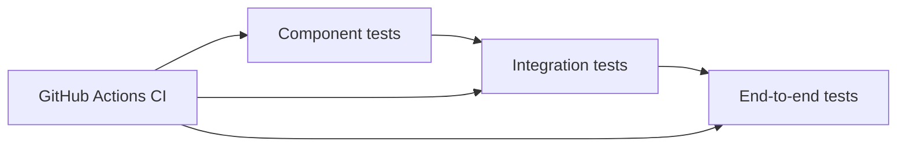

# Currency Converter Application

The Currency Converter application allows users to convert currencies from around the world at current exchange rates.

## Access the App

You can access the Currency Converter app here: https://currency-exchange-nadiia.netlify.app


## Built With

- React
- Material-UI

## APIs Used

- Rest Countries API : https://restcountries.com/v3.1/all - Used to fetch the list of countries.
- FXRates API: https://api.fxratesapi.com/latest - Used to get the latest currency rates.

## Testing

The project uses a layered testing approach to keep the app reliable and easy to maintain:

- Component and unit tests validate rendering, user interactions, and form logic.
- Integration tests cover the main conversion flow and error handling.
- End-to-end tests verify the app in a real browser.

Coverage focuses on currency selection, amount input, conversion behavior, switching currencies, and failure states.

Tools used:

- Vitest + Testing Library for fast UI and component tests
- Playwright for browser-level regression testing
- MSW for mocking API responses

The CI/CD pipeline is configured in GitHub Actions and runs automated checks on push and pull request events.



### How to run tests locally

```bash
npm install
```

Run unit and component tests:

```bash
npm run test -- --run
```

Run integration tests:

```bash
npx vitest run tests/integration
```

Run end-to-end tests:

```bash
npx playwright test
```

## Available Scripts

In the project directory, you can run:

```bash
npm install
```

Install All dependencies in this project

```bash
npm run dev
```

Runs the app in the development mode.
Open http://127.0.0.1:5173 to view it in the browser.
